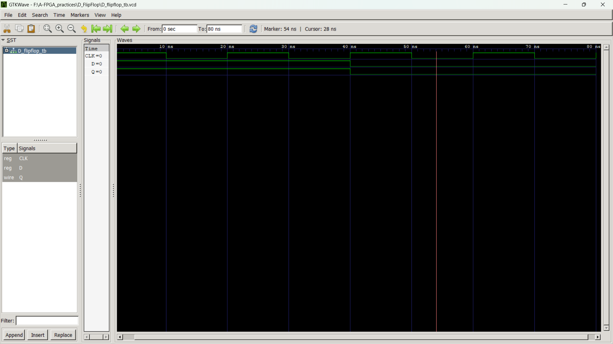

# D Flip-Flop Simulation in Verilog

## Overview
This project simulates the behavior of a **D Flip-Flop** using Verilog HDL. A D Flip-Flop is a fundamental memory element used in digital electronics for storing binary data. It captures the value of the data input (D) at a rising clock edge and holds it until the next clock edge.

The project uses **GTKWave** to visualize the simulation results, providing insights into the flip-flop's operation and timing characteristics.

## Table of Contents
- [Project Structure](#project-structure)
- [Prerequisites](#prerequisites)
- [Usage Instructions](#usage-instructions)
- [Simulation Output](#simulation-output)
- [License](#license)

## Project Structure
```
.
├── D_flipflop.v        # Verilog module for D Flip-Flop
├── D_flipflop_tb.v     # Testbench for simulating the D Flip-Flop
├── D_flipflop_tb.vcd   # File used for the simulation
├──D_flipflop.vvp       # Output file after verilog compilation
├── D_flipflop_simulation.png  # Screenshot of GTKWave simulation output
├── README.md           # Project documentation
```

## Prerequisites
To run this project, ensure you have the following tools installed:

- **Verilog Compiler/Simulator** ( I used Icarus Verilog)
- **GTKWave** for waveform visualization

## Usage Instructions
1. Compile and run the Verilog simulation:
   ```sh
   iverilog -o D_flipflop_tb.vvp D_flipflop_tb.v
   vvp D_flipflop_tb.vvp
   ```
2. Open the waveform dump file (`.vcd`) using GTKWave:
   ```sh
   gtkwave d_flipflop.vcd
   ```

## Simulation Output
The simulation output demonstrates the behavior of the D Flip-Flop:

- The `D` input is sampled on the rising edge of the `clock` signal.
- The `Q` output reflects the value of `D` at the clock edge and holds the value until the next rising edge.


### GTKWave Visualization


The waveform shows the relationship between the `D`, `clock`, and `Q` signals, helping to validate the flip-flop's operation.

## License
This project is open-source and available under the MIT License. See the `LICENSE` file for details.

